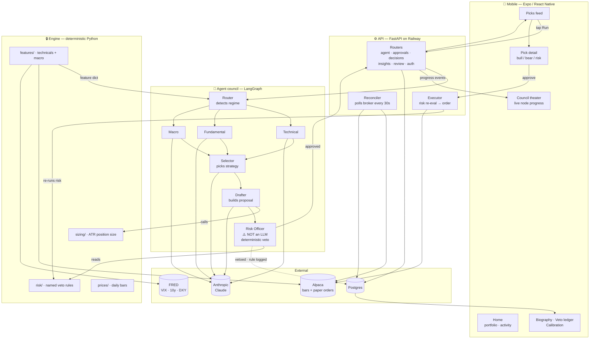
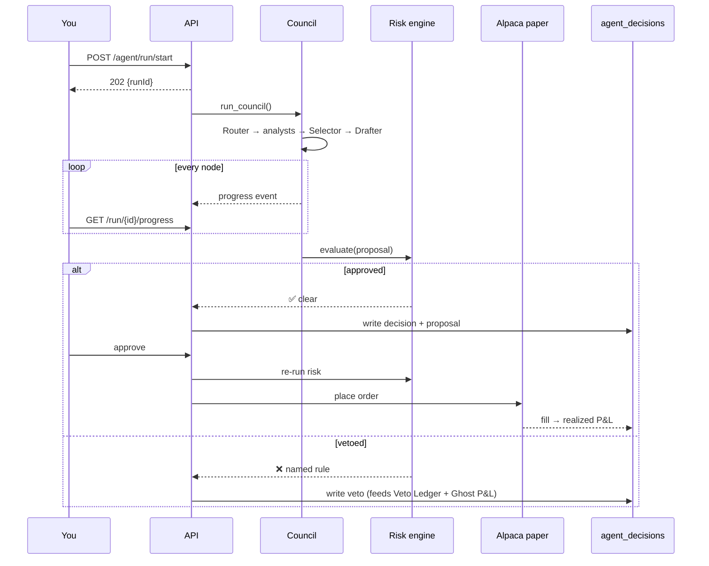

# Autonomous Trading Agent

US-equities swing-trading system. An LLM **agent council** proposes trades, a
**deterministic risk engine** decides/sizes/vetoes them, and a mobile app
surfaces every pick plus a full audit trail.

> **The one architectural rule: agents propose, deterministic code disposes.**
> LLM output is never the kill-switch. Every order routes through
> `packages/engine/risk` → `packages/broker`. Risk vetoes are plain Python
> with named rule identifiers (`pdt_block`, `drawdown_halt`, …).

---

## Architecture



### Decision lifecycle



**Every council run writes exactly one `agent_decisions` row** — approved,
held, or vetoed. That row is the audit anchor the trade biography, veto
ledger, ghost P&L and calibration scorecard all read from.

---

## Repo layout

```
apps/
  agents/     Agent council (LangGraph) + daily cron + ghost evaluator
    trading_agents/
      nodes/      One file per agent: router, technical, fundamental,
                  macro, selector, drafter, risk_officer, reflection
      prompts/    System prompt per agent
      memory/     DecisionLog + StrategyConfidence (in-memory + Postgres)
      graph.py    Wires the nodes; LangGraph with asyncio fallback
      runtime.py  run_council() — the public entry point
      llm.py      Anthropic wrapper (prompt caching, MOCK fallback)
      tracing.py  Langfuse — one trace/run, one generation/agent
    trading_agents/cli/    council.py, reflection.py   (run by hand)
    trading_agents/jobs/   daily_cron.py, ghost_eval.py (run by cron)
  api/        FastAPI gateway (deployed to Railway) — also serves the web
              build below (static assets + SPA catch-all; API routes and
              /health always win their match first)
    app/routers/   agent, approvals, decisions, insights, review, auth, health
    app/services/  auth/ broker/ orders/ council/ notifications/ platform/
                    (six subpackages, grouped by import coupling — see
                    fable5findings.md's build log for the exact split)
  mobile/     Expo React Native app — two design systems, one codebase
    app/           Phone screens (expo-router file routing)
    src/hooks/     TanStack Query hooks, one per endpoint family — shared
                    by both design systems below
    src/components/DesktopShell.tsx   The switch point: native or web
                    <1024px renders the phone UI untouched; web ≥1024px
                    with a session replaces it with desktop/ instead
    src/desktop/   Platinum Glass desktop UI (web only, ≥1024px) — own
                    theme/nav/screens, never shares a component with the
                    phone tree (see STITCH_DESIGN_SYSTEM.md)

packages/
  engine/     Deterministic core — NO LLM anywhere in here
    risk/       Named veto rules + evaluate()
    sizing/     ATR position sizing
    features/   Real technicals (Alpaca bars) + macro (FRED)
    prices/     Daily close providers (Alpaca | seeded synthetic)
    reconciler/ Broker polling → positions_snapshot + circuit breaker
    backtester/ Event-driven backtester + walk-forward
    db/models.py  All SQLAlchemy models — single source of truth
  broker/     BrokerInterface + Alpaca (US) and Zerodha (India) impls
  ui/         Shared RN components + design tokens
  shared-types/  TypeScript DTOs shared by mobile + API

infra/migrations/   Alembic migrations (auto-applied on deploy)
```

---

## Quick start

```bash
make install          # pnpm + uv workspaces
make dev-api          # FastAPI on :8000 (in-memory, no DB needed)
make dev-mobile       # Expo dev server on :8081
make test             # pytest (Python side; the JS test runner is
                       # currently non-functional — see fable5findings.md)
make lint typecheck
```

Local Postgres (optional — defaults to in-memory stores):

```bash
make infra-up && make migrate && make dev-api-postgres
```

Run the council headlessly:

```bash
uv run --package agents python -m trading_agents.jobs.daily_cron --force
```

---

## Environment variables

### Required in production

| Var | Purpose |
|---|---|
| `ENV` | `production` |
| `USE_POSTGRES` | `1` — switches every store to Postgres |
| `DATABASE_URL` | Set automatically by the Railway Postgres plugin |
| `DEV_AUTH_BYPASS` | `0` — must be off in production |
| `JWT_SECRET` | Generate fresh, 32+ bytes |
| `BROKER_TOKEN_ENCRYPTION_KEY` | Fresh base64 Fernet key — encrypts broker tokens |
| `CORS_ORIGINS` | e.g. `exp://exp.host,https://exp.host` |

### Unlock real behavior

| Var | Without it |
|---|---|
| `ANTHROPIC_API_KEY` | Council runs in **MOCK mode** — canned `"MOCK: …"` theses |
| `ALPACA_API_KEY` + `ALPACA_SECRET_KEY` | Synthetic prices; no broker orders. Free paper keys from app.alpaca.markets (Paper toggle **on**) |
| `FRED_API_KEY` | Macro analyst has no VIX / 10y / DXY. Free instant signup |
| `LANGFUSE_PUBLIC_KEY` + `LANGFUSE_SECRET_KEY` | Tracing is a silent no-op |
| `SENTRY_DSN` | No error tracking |
| `RESEND_API_KEY` | Magic-link email won't send |

### Safety switches

| Var | Default | Meaning |
|---|---|---|
| `LIVE_TRADING_ENABLED` | off | Any non-paper order is blocked with `live_trading_disabled` |
| `TRADING_MODE` | `paper` | Paper simulation vs real broker routing |
| `AGENTS_REQUIRE_REAL_LLM` | off | `1` = refuse to run on canned MOCK responses |
| `AGENTS_REQUIRE_REAL_DATA` | off | `1` = refuse to run on synthetic features |
| `DRAWDOWN_HALT_THRESHOLD_PCT` | `-3.0` | Circuit breaker trip point |
| `ALLOW_OPTIONS` | **off** | `1` = the council may draft options. Off ⇒ `options_disabled` vetoes every option. Both this **and** a watchlist row's `asset_class='option'` are required |
| `ALLOW_SHORTS` | **off** | `1` = the fit node scores short directions for an EQUITY pass, and `forbid_short_phase_0`/`shortable_check`/`short_requires_stop`/`short_unbounded_loss_cap` stop vetoing every short. Off ⇒ equities stay long-only. Does **not** gate a PUT: an options-eligible pass (`ALLOW_OPTIONS=1` + a `asset_class='option'` watchlist row) scores the short direction regardless of this flag, because buying a put never opens a short position — see `docs/OPTIONS_PLAYBOOK.md` §1.2 |

Both safety switches **fail closed** — an unset, empty, or misspelled value leaves them
off. That is the direction that cannot lose money by accident.

### Options data-quality floors (tunable without a redeploy)

| Var | Default | Meaning |
|---|---|---|
| `OPTIONS_MIN_OPEN_INTEREST` | `100` | Real OI, from `/v2/options/contracts`. The actual liquidity gate |
| `OPTIONS_MIN_VOLUME` | `1` | **Not** daily volume — a last-trade-size proxy (alpaca-py's `OptionsSnapshot` drops the `dailyBar` block). `0` disables it |
| `OPTIONS_MAX_SPREAD_PCT` | `12.0` | `(ask-bid)/mid`. Widened from 8 because the 15-min delayed indicative book reads wider than the one an order fills against |
| `OPTIONS_TAKE_PROFIT_PCT` | `60.0` | Close a long option once its **premium** is up this much. Alpaca cannot bracket a single-leg option, so this exit lives in our own sweep — see [`OPTIONS_PLAYBOOK.md`](OPTIONS_PLAYBOOK.md) §3 |
| `OPTIONS_STOP_LOSS_PCT` | `50.0` | Close once the premium has lost this much (positive magnitude). Gated on `abs()`, so a `-50` typo still stops out — only an explicit `0` disables it |

The first three are **calibration against a delayed feed**, not loss limits — getting them wrong
means the agent refuses everything, not that it risks too much. The two exit
thresholds are tunable for a different reason: they only decide *when* to realize a
position whose size the caps below already bounded, so no setting of them can increase
maximum loss beyond the premium already paid. The loss limits
(`options_max_premium_pct`, `options_max_total_premium_pct`, `max_position_pct`,
`daily_drawdown_halt_pct`) are deliberately **code-level and not env-tunable**: a cap
that an unreviewed env var can widen is not a cap.

Mobile needs `EXPO_PUBLIC_API_URL` in `apps/mobile/.env`.

---

## Deploy (Railway)

1. Push to GitHub → Railway → New Project → Deploy from repo
   (auto-detects `railway.toml` + `apps/api/Dockerfile`)
2. Add the **Postgres** plugin — `DATABASE_URL` is injected
3. Set the required env vars above
4. The Dockerfile's `web-builder` stage exports `apps/mobile` for web and
   bakes it into the image; `apps/api/scripts/start.sh` runs
   `alembic upgrade head` then launches uvicorn, which serves that web
   build directly — visiting the Railway URL in a browser opens the app
   itself (desktop-width → Platinum Glass, phone-width → the mobile UI),
   no separate static-hosting step needed

Point the native mobile app at it:

```bash
echo "EXPO_PUBLIC_API_URL=https://<your-app>.up.railway.app" > apps/mobile/.env
make dev-mobile
```

---

## Observability

| Concern | Where |
|---|---|
| Per-agent traces, latency, cost | Langfuse (`tracing.py`) — one trace/run, one generation/node |
| LLM spend | `llm_calls` table + `/api/v1/health/full` |
| Errors | Sentry (FastAPI integration) |
| Component health | `GET /api/v1/health/full` — council, approvals, broker, reconciler, LLM cost |
| Prompt caching | Enabled on every system block; cache tokens tracked in the ledger |

---

## Scope

**In v1:** US equities + ETFs · Alpaca paper → live · swing trades (1–10 day
holds, daily bars) · LangGraph council · per-trade self-approval.

**Out of v1:** options/F&O · intraday (v1.5) · India/Zerodha (v2) ·
real-time tick data · performance-fee pricing.

**This is not** a real-time trading system — it runs on **daily bars**, with
the reconciler polling account state every 30s. It is not financial advice,
and nothing here should touch real money before the Phase-4 paper-validation
gate in `PLAN.md`.

---

## Related documents

| File | What |
|---|---|
| `CLAUDE.md` | Contract for AI agents working in this repo — read before writing code |
| `PLAN.md` | Full product + phase roadmap |
| `DESIGN.md` | Mobile design system (tokens, components, rules) |
| `STITCH_DESIGN_SYSTEM.md` | Desktop web design system ("Platinum Glass") — the companion to `DESIGN.md`, never blended with it |
| `fable5findings.md` | Running build log (one entry per commit) + an indexed "Technical debt & follow-ups" list of what's known-pending |
