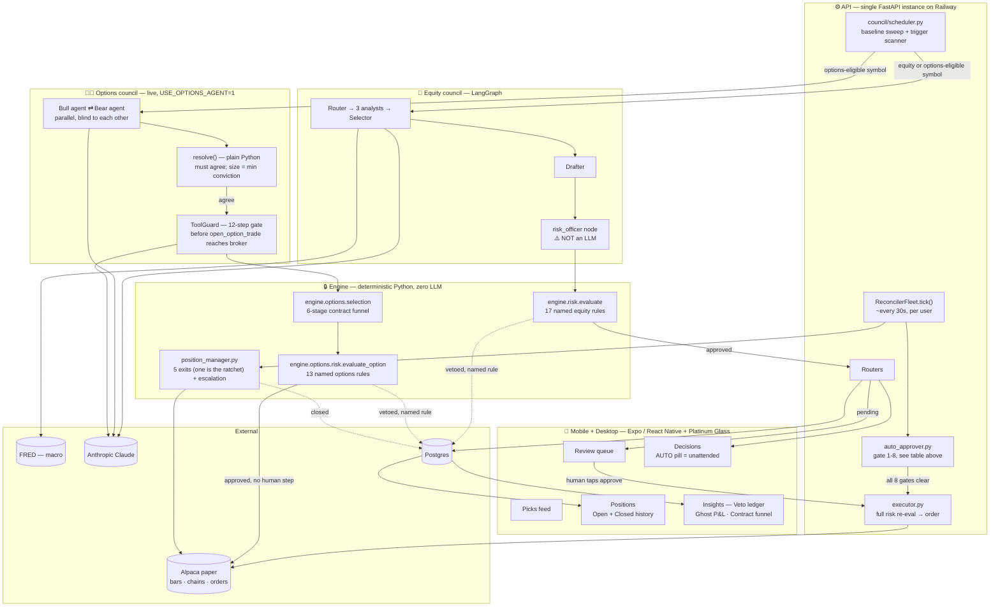
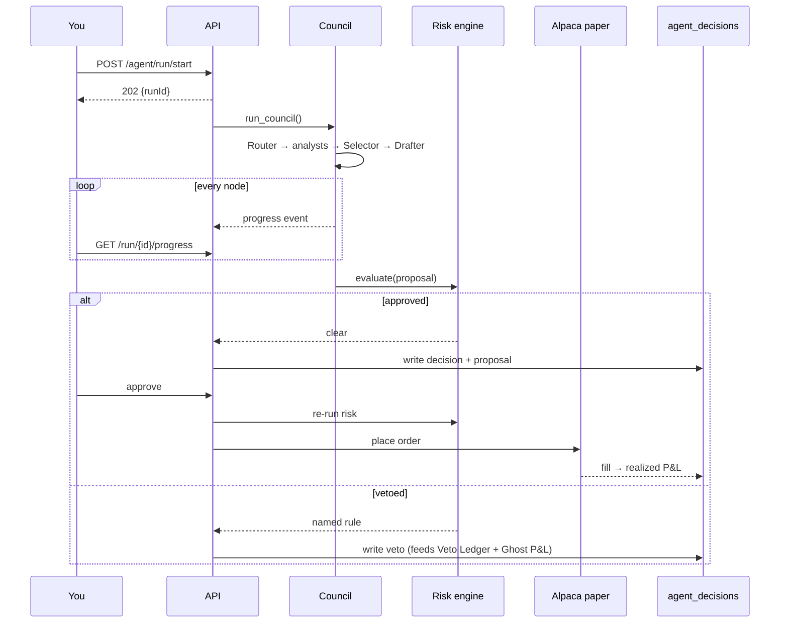

# Autonomous Trading Agent

US-equities-and-options swing-trading system. An LLM **agent council** proposes
trades, a **deterministic risk engine** decides/sizes/vetoes them, and — as of the
last 24 hours — some of those trades can now execute with **no human in the loop**,
through two separate gated mechanisms described in full below. A mobile + desktop
app surfaces every pick plus a full audit trail.

> **The one architectural rule: agents propose, deterministic code disposes.**
> LLM output is never the kill-switch, on any path, attended or not. Every order
> routes through `packages/engine/risk` → `packages/broker`. Risk vetoes are plain
> Python with named rule identifiers (`pdt_block`, `drawdown_halt`,
> `max_premium_pct`, …). Adding unattended execution did not change this rule — it
> changed *who asks* the deterministic gate to run, never what the gate does.

---

## What "autonomous" means here, precisely

Two separate mechanisms can put an order at Alpaca with nobody watching. Neither is
on by default; neither is a variant of the other. Full detail, gate-by-gate: root
[`README.md`](../README.md)'s "How autonomous is 'autonomous'" section. Summary:

| | Equity (and legacy-path options) | Options — live Bull/Bear council |
|---|---|---|
| Master switch | `AUTO_APPROVE_ENABLED` (operator env) | `AUTO_TRADE_ENABLED` (separate env var) |
| Second key | `auto_approve_consent` — per-connection, set by the account owner in-app | none needed — the two agents must independently agree, which is its own second check |
| Where it lives | `apps/api/app/services/orders/auto_approver.py`, called from `ReconcilerFleet.tick()` | `apps/agents/trading_agents/options/tools/guard.py`'s `ToolGuard`, called from the council graph directly |
| What it re-checks | The full risk engine, via the same `execute_proposal()` a human tap calls | The full risk engine, as the last of a 12-step gate, inside the tool call itself |
| Paper-only | Hard-coded boolean, not a flag | Hard-coded boolean, not a flag (same check, duplicated on purpose across both mutating tools — see `docs/OPTIONS_PLAYBOOK.md` §5, trap 6) |
| Rate limit | 1 per ~30s reconciler tick, ≤5/day (both env-tunable) | 1 `open_option_trade` per council pass |

Once a position is open, exits are unattended by construction for options (Alpaca
cannot bracket a single-leg option — see below) and partially unattended for
equities (a broker-side bracket handles price levels; `exit_mode=agent` adds a
time-stop/signal-exit on top). The options side also carries a secondary, **strictly
monotone** LLM — it may tighten a stop, raise a take-profit, close early, or scale in
(with a full risk re-check), and can never loosen anything — capped at
`MAX_ESCALATIONS_PER_FLEET_TICK = 1` (hard-coded, not env-tunable) across the whole
fleet, not per position. See `docs/OPTIONS_PLAYBOOK.md` §3 and
`apps/agents/trading_agents/options/escalation.py`'s module docstring for the full
design rationale and its fail-safe (error/timeout/MOCK mode → nothing moves).

---

## Architecture



### Decision lifecycle — the human path



### The other lifecycle — unattended

```mermaid
sequenceDiagram
    participant F as ReconcilerFleet tick
    participant AP as auto_approver
    participant B as options Bull/Bear
    participant G as ToolGuard
    participant R as Risk engine
    participant X as Alpaca paper

    Note over F,AP: Equity path — a proposal already sat in the pending queue
    F->>AP: auto_approve_for_user()
    AP->>AP: gates 1-8 (env, consent, hours, age, budget, tick cap, halt)
    AP->>R: execute_proposal() — the SAME re-check a human tap triggers
    R-->>X: order, only if every gate + the full risk engine cleared

    Note over B,X: Options path — no pending queue; live inside one council pass
    B->>B: Bull and Bear form views in parallel, blind to each other
    B->>G: resolved direction agreed -> open_option_trade
    G->>G: 12-step gate (paper-only, hours, one-per-pass, thesis, ...)
    G->>R: evaluate_option() — the full 13-rule options sequence
    R-->>X: order, only if the gate AND the risk engine both cleared
```

**Every council run writes exactly one `agent_decisions` row** — approved, held, or
vetoed, human path or unattended — and that row is the audit anchor the trade
biography, veto ledger, ghost P&L, contract funnel, and calibration scorecard all
read from. An unattended row is distinguished only by `approval_mode='auto'`,
stamped strictly *after* execution succeeds — a row that never actually executed
must never read as autonomous.

---

## Repo layout

```
apps/
  agents/     Agent council (LangGraph) + daily cron + ghost evaluator
    trading_agents/
      nodes/       Equity agents: router, technical, fundamental, macro,
                   selector, drafter, risk_officer, reflection
      options/     The live options council — separate from nodes/ above:
        agents.py       Bull/Bear — parallel view, then resolve(), then a
                        guarded tool-calling hop for the winner only
        resolution.py   resolve() — plain Python, no LLM: both must agree;
                        size = the LESS confident agent's conviction
        escalation.py   The secondary, monotone LLM exit consult — tighten/
                        bank/close-early/scale-in only, never loosen
        tools/
          guard.py      ToolGuard — the 12-step gate + the ratchet invariant
                        for adjust_option_position; the ONLY door to
                        packages/broker for this entire subpackage
          trade.py      Thin executor: place the order, write the row —
                        no risk logic of its own left to get wrong
          readonly.py   Six read-only tools (get_iv_rank, etc.) — no gate
                        needed, nothing here reaches the broker
        prompts.py      OPTIONS_BULL / OPTIONS_BEAR / OPTIONS_ESCALATION
      prompts/     System prompt per equity agent
      memory/      DecisionLog + StrategyConfidence (in-memory + Postgres)
      graph.py     Wires the equity nodes; LangGraph with asyncio fallback
      runtime.py   run_council() — the public entry point
      llm.py       Anthropic wrapper (prompt caching, tool support, MOCK fallback)
      llm_loop.py  The tool-calling loop both options hops (agents.py,
                   escalation.py) share
      tracing.py   Langfuse — one trace/run, one generation/agent
    trading_agents/jobs/   daily_cron.py, ghost_eval.py (run by cron)
  api/        FastAPI gateway (deployed to Railway) — also serves the web
              build below (static assets + SPA catch-all; API routes and
              /health always win their match first)
    app/routers/   agent, approvals, decisions, insights, review, auth,
                   positions, health
    app/services/
      council/     scheduler.py (baseline sweep + trigger scanner — what
                   actually makes picks appear without a human tapping
                   Run), store.py, decisions_list.py, funnel_service.py,
                   ghost_service.py, scanner_status.py
      orders/      executor.py, auto_approver.py (the equity sweeper),
                   position_manager.py (the 5 deterministic exits, one of
                   which IS the trailing ratchet, plus the escalation
                   hook), reconciler_fleet.py (per-user broker
                   reconciliation, ~30s tick), order_sync.py
      broker/ auth/ notifications/ platform/
  mcp_server/ Our OWN read/propose-only MCP server — separate from, and
              does not satisfy, the hackathon's "Alpaca's own MCP/CLI"
              requirement. See apps/mcp_server/README.md.
  mobile/     Expo React Native app — two design systems, one codebase
    app/           Phone screens (expo-router file routing)
    src/hooks/     TanStack Query hooks, one per endpoint family
    src/components/DesktopShell.tsx   <1024px = phone UI; web ≥1024px
                   with a session = src/desktop/ instead
    src/desktop/   Platinum Glass desktop UI (web only, ≥1024px)

packages/
  engine/     Deterministic core — NO LLM anywhere in here
    risk/        engine.py (17 named equity rules, first-veto-wins) +
                 rules/ (one file per rule) + postgres_context.py
    options/     risk.py (13 named options rules — its own sequence,
                 dispatched to from risk/engine.py the instant a proposal
                 is an option), selection.py (6-stage contract funnel),
                 sizing.py, exits.py (the ratchet + the 5 exit signals),
                 expiry.py, greeks.py, contracts.py (chain fetch)
    scanner/     engine.py + triggers.py + cooldown.py — the cheap,
                 zero-LLM trigger loop the scheduler wakes the council with
    features/    Real technicals (Alpaca bars), macro (FRED),
                 alpaca_cli.py (the `alpaca clock` subprocess wrapper),
                 market_calendar.py, clock.py
    prices/      Daily close providers (Alpaca | seeded synthetic)
    reconciler/  Broker polling → positions_snapshot + circuit breaker
    backtester/  Event-driven backtester + walk-forward
    db/models.py   All SQLAlchemy models — single source of truth
  broker/     BrokerInterface + Alpaca (US) and Zerodha (India) impls
  ui/         Shared RN components + design tokens
  shared-types/  TypeScript DTOs shared by mobile + API

infra/migrations/   Alembic migrations (auto-applied on deploy)
```

---

## Quick start

```bash
make install          # pnpm + uv workspaces
make dev-api          # FastAPI on :8000 (in-memory, no DB needed)
make dev-mobile       # Expo dev server on :8081
make test             # pytest (Python side; see fable5findings.md for the
                       # current state of the JS test runner)
make lint typecheck
```

Local Postgres (optional — defaults to in-memory stores):

```bash
make infra-up && make migrate && make dev-api-postgres
```

Run the council headlessly:

```bash
uv run --package agents python -m trading_agents.jobs.daily_cron --force
```

---

## Environment variables

### Required in production

| Var | Purpose |
|---|---|
| `ENV` | `production` |
| `USE_POSTGRES` | `1` — switches every store to Postgres |
| `DATABASE_URL` | Set automatically by the Railway Postgres plugin |
| `DEV_AUTH_BYPASS` | `0` — must be off in production |
| `JWT_SECRET` | Generate fresh, 32+ bytes |
| `BROKER_TOKEN_ENCRYPTION_KEY` | Fresh base64 Fernet key — encrypts broker tokens |
| `CORS_ORIGINS` | e.g. `exp://exp.host,https://exp.host` |

### Unlock real behavior

| Var | Without it |
|---|---|
| `ANTHROPIC_API_KEY` | Council runs in **MOCK mode** — canned `"MOCK: …"` theses, and every tool-calling hop (options agents, escalation) short-circuits to zero tool calls |
| `ALPACA_API_KEY` + `ALPACA_SECRET_KEY` | Synthetic prices; no broker orders. Free paper keys from app.alpaca.markets (Paper toggle **on**) |
| `FRED_API_KEY` | Macro analyst has no VIX / 10y / DXY. Free instant signup |
| `LANGFUSE_PUBLIC_KEY` + `LANGFUSE_SECRET_KEY` | Tracing is a silent no-op |
| `SENTRY_DSN` | No error tracking |
| `RESEND_API_KEY` | Magic-link email won't send |

### Autonomy switches — every one fails closed (unset/malformed = off)

| Var | Default | Meaning |
|---|---|---|
| `LIVE_TRADING_ENABLED` | off | Any non-paper order is blocked with `live_trading_disabled`. Every check below is written to stay refused even if this were flipped by mistake — see `docs/OPTIONS_PLAYBOOK.md` §5.6 |
| `TRADING_MODE` | `paper` | Paper simulation vs real broker routing |
| `AUTO_APPROVE_ENABLED` | **off** | Operator master switch for the equity sweeper. Needs `auto_approve_consent` (below, a DB field not an env var) on top before anything executes — see the table near the top of this file |
| `AUTO_APPROVE_MAX_AGE_MIN` | `60` | A pending proposal older than this is never auto-approved |
| `AUTO_APPROVE_MAX_PER_DAY` | `5` | Per user, per UTC day |
| `AUTO_TRADE_ENABLED` | **off** | Master switch for the options council's `open_option_trade` / `adjust_option_position` actually reaching the broker. Independent of `AUTO_APPROVE_ENABLED` — flipping one does not flip the other |
| `ALLOW_OPTIONS` | **off** | `1` = the council may consider options at all for a symbol. Off ⇒ `options_disabled` vetoes every option. Both this **and** a watchlist row's `asset_class='option'` are required |
| `USE_OPTIONS_AGENT` | off | `1` = an options-eligible pass forks into the live Bull/Bear council above. `0` returns options to the older single-drafter path (still human-approval-gated, no `AUTO_TRADE_ENABLED` involved) |
| `ALLOW_SHORTS` | **off** | `1` = the fit node scores short directions for an EQUITY pass. Does **not** gate a bearish OPTIONS thesis — a bought put never opens a short position, so an options-eligible pass scores "short" regardless of this flag (`docs/OPTIONS_PLAYBOOK.md` §1.2) |
| `RISK_PROFILE` | `conservative` | `conservative` or `aggressive_paper` (wider options premium caps, tighter stop — see `docs/OPTIONS_PLAYBOOK.md` §2-4). A reviewed, in-git choice between two profiles — never a raw number |
| `DRAWDOWN_HALT_THRESHOLD_PCT` | `-3.0` | Circuit breaker trip point. Does **not** move between risk profiles |
| `AGENTS_REQUIRE_REAL_LLM` / `AGENTS_REQUIRE_REAL_DATA` | off | `1` = refuse to run on canned MOCK responses / synthetic features |

Two connection-level toggles are set from **inside the app**, not the environment,
and are not listed above for that reason: `auto_approve_consent` (per Alpaca
connection — the account owner's own key for the equity sweeper) and
`live_trading_consent` (the equivalent for live trading, unrelated to paper-only
autonomy).

### Options data-quality floors and exit tuning (env-tunable without a redeploy)

| Var | Default | Meaning |
|---|---|---|
| `OPTIONS_MIN_OPEN_INTEREST` | `100` | Real OI, from `/v2/options/contracts`. The actual liquidity gate |
| `OPTIONS_MIN_VOLUME` | `1` | **Not** daily volume — a last-trade-size proxy (alpaca-py's `OptionsSnapshot` drops the `dailyBar` block) |
| `OPTIONS_MAX_SPREAD_PCT` | `12.0` | `(ask-bid)/mid` — widened from 8 because the 15-min delayed indicative book reads wider than the one an order fills against |
| `OPTIONS_RATCHET_ENABLED` | **on** | The one flag here that fails OPEN, not closed — the trailing ratchet is the intended behavior. `0`/`false` reverts every open option to a flat take-profit/stop-loss |
| `OPTIONS_TRAIL_ARM_PCT` | `35.0` | Peak gain that arms the trail |
| `OPTIONS_TRAIL_GIVEBACK_PCT` | `30.0` | Percent OF THE PEAK given back before the trail closes, not percentage points |
| `OPTIONS_HARD_TAKE_PROFIT_PCT` | `150.0` | Backstop ceiling regardless of the trail |
| `OPTIONS_STOP_LOSS_PCT` | `50.0` (`conservative`) / `40.0` (`aggressive_paper`) | Read by both the ratchet's stop and the legacy flat exit |
| `OPTIONS_TAKE_PROFIT_PCT` | `60.0` | Read only when the ratchet is disabled |
| `OPTIONS_ESCALATION_COOLDOWN_S` | `900.0` | Minimum seconds between escalation consults for the SAME position |
| `OPTIONS_ESCALATION_MAX_PER_DAY` | `4` | Per position, per day |

The loss limits (`options_max_premium_pct`, `options_max_total_premium_pct`,
`max_position_pct`, `daily_drawdown_halt_pct`) are deliberately **code-level and not
env-tunable**: a cap that an unreviewed env var can widen is not a cap. Only
`RISK_PROFILE`, above, can move the first two, and only between two reviewed
profiles.

Mobile needs `EXPO_PUBLIC_API_URL` in `apps/mobile/.env`.

---

## Deploy (Railway)

1. Push to GitHub → Railway → New Project → Deploy from repo
   (auto-detects `railway.toml` + `apps/api/Dockerfile`)
2. Add the **Postgres** plugin — `DATABASE_URL` is injected
3. Set the required env vars above
4. The Dockerfile's `web-builder` stage exports `apps/mobile` for web and
   bakes it into the image; `apps/api/scripts/start.sh` runs
   `alembic upgrade head` then launches uvicorn, which serves that web
   build directly — visiting the Railway URL in a browser opens the app
   itself (desktop-width → Platinum Glass, phone-width → the mobile UI),
   no separate static-hosting step needed

Point the native mobile app at it:

```bash
echo "EXPO_PUBLIC_API_URL=https://<your-app>.up.railway.app" > apps/mobile/.env
make dev-mobile
```

---

## Observability

| Concern | Where |
|---|---|
| Per-agent traces, latency, cost | Langfuse (`tracing.py`) — one trace/run, one generation/node |
| LLM spend | `llm_calls` table + `/api/v1/health/full` |
| Errors | Sentry (FastAPI integration) |
| Component health | `GET /api/v1/health/full` — council, approvals, broker, reconciler, LLM cost |
| Prompt caching | Enabled on every system block; cache tokens tracked in the ledger |

---

## Scope

**In now:** US equities + ETFs + single-leg long calls/puts (Phase A options — no
spreads, no selling to open, no assignment handling) · Alpaca paper, hard-coded ·
swing trades (1–10 day holds, daily bars) · two council shapes (equity LangGraph
council; options Bull/Bear two-agent council) · per-trade human approval **or**
unattended execution under the explicit gates described above.

**Out of scope:** intraday (v1.5) · India/Zerodha (v2, code exists, dark for the
contest) · real-time tick data · performance-fee pricing · option spreads,
short-selling options, or auto-exercise/assignment handling.

**This is not** a real-time trading system — it runs on **daily bars** for equities
and a scheduler that sweeps/scans on the order of minutes, not ticks, with the
reconciler polling account state roughly every 30 seconds. It is not financial
advice, and every account this system can reach is a paper account, by a check
written so no environment variable changes that.

---

## Related documents

| File | What |
|---|---|
| `CLAUDE.md` | Contract for AI agents working in this repo — read before writing code |
| `docs/HACKATHON.md` | The current mission, deadline, hard requirements, and positioning |
| `docs/OPTIONS_PLAYBOOK.md` | The authoritative, code-derived rule set for options — every threshold, veto, and exit, with the reasoning and the traps that have already bitten |
| `PLAN.md` | Product + phase roadmap (older; see `docs/PLAN_NEXT.md` for the current queue) |
| `DESIGN.md` | Mobile design system (tokens, components, rules) |
| `STITCH_DESIGN_SYSTEM.md` | Desktop web design system ("Platinum Glass") — the companion to `DESIGN.md`, never blended with it |
| `fable5findings.md` | Running build log (one entry per commit) + an indexed "Technical debt & follow-ups" list of what's known-pending |
